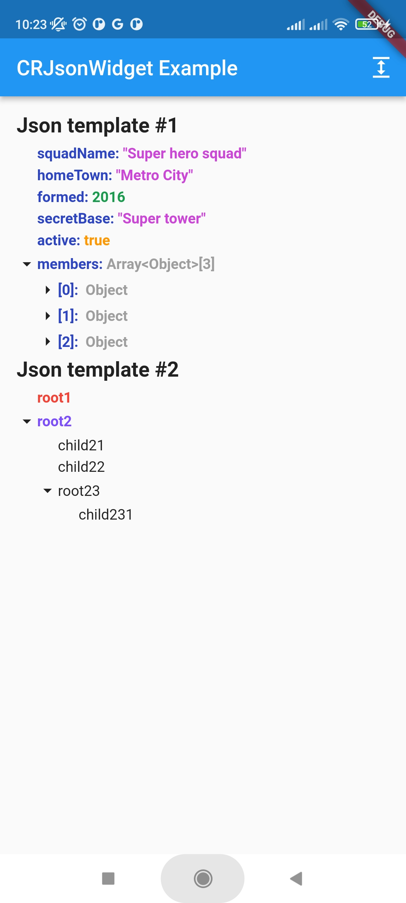
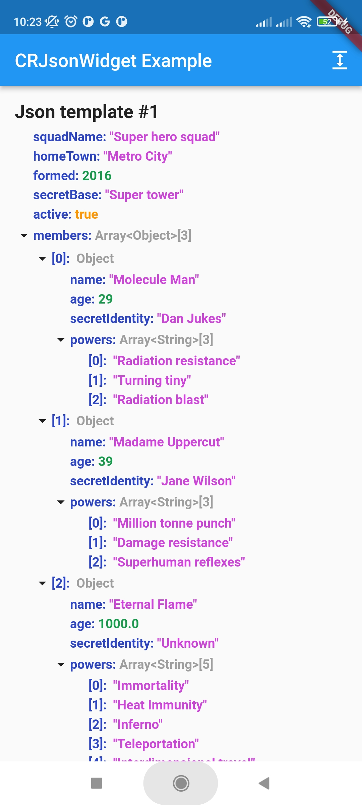

# cr_json_widget

This widget visualises a tree structure, where a node can be any widget.

## Getting Started

1. Add plugin to your project:
    ```yaml
    dependencies:
        cr_json_widget: ^0.9.0
    ```

## Usage
1. Create JsonController:
    ```
    final _jsonController = JsonController(
        allNodesExpanded: false,
        uncovered: 3,
    );
    ```
   `allNodesExpanded` - Sets whether the json tree is expanded by default

   `uncovered` - Sets the value to what nesting by default the json tree will be expanded
2. Add widget:
   2.1 Accepts json as Map <String, Any> and builds the tree automatically:
    ```
        ...
        final data = <String, dynamic>{
            'integer': 1, 
            'string': 'test', 
        }
        ...
        CrJsonWidget(
            ..
            json: data
        )
        ...
    ```
   2.2 Accepts your custom List <JsonNode>, for placement in the form of a tree:
    ```
        CrJsonWidget(
            ..
        jsonNodes: [
            JsonNode(
                content: const Text(
                    'root1',
                    style: TextStyle(
                        fontWeight: FontWeight.bold,
                        color: Colors.red,
                    ),
                ),
            ),
            JsonNode(
                content: const Text(
                    'root2',
                    style: TextStyle(
                        fontWeight: FontWeight.bold,
                        color: Colors.deepPurpleAccent,
                    ),
                ),
                children: [
                    JsonNode(
                        content: const Text('child21'),
                    ),
                    JsonNode(
                        content: const Text('child22'),
                    ),
                    JsonNode(
                        content: const Text('root23'),
                        children: [
                            JsonNode(
                                content: const Text('child231'),
                            ),
                        ],
                        ),
                    ],
                ),
            ],
        ),
    ```
Full implementation example:
```
    ...
    CrJsonWidget(
        iconOpened: Icon(
            Icons.arrow_drop_down,
            size: _iconSize,
        ),
        iconClosed: Icon(
            Icons.arrow_right,
            size: _iconSize,
        ),
        indentHeight: 5,
        indentLeftEndJsonNode: _iconSize,
        jsonNodes: [
            JsonNode(
                content: const Text(
                    'root1',
                    style: TextStyle(
                        fontWeight: FontWeight.bold,
                        color: Colors.red,
                    ),
                ),
            ),
            JsonNode(
                content: const Text(
                    'root2',
                    style: TextStyle(
                        fontWeight: FontWeight.bold,
                        color: Colors.deepPurpleAccent,
                    ),
                ),
                children: [
                    JsonNode(
                        content: const Text('child21'),
                    ),
                    JsonNode(
                        content: const Text('child22'),
                    ),
                    JsonNode(
                        content: const Text('root23'),
                        children: [
                            JsonNode(
                                content: const Text('child231'),
                            ),
                        ],
                        ),
                    ],
                ),
            ],
        jsonController: _jsonController,
    ),
```
`iconOpened` - Custom icon for opening a node

`iconClosed` - Custom icon for closing a node

`indentHeight` - Vertical indent between levels

`indentLeftEndJsonNode` - The starting position of the ending node ***(Recommended size is the size of the icon)***

`json` - Parsed json

`jsonNodes` - List of root level json nodes

`jsonController` - Json controller to manage the json state

## Examples
  

